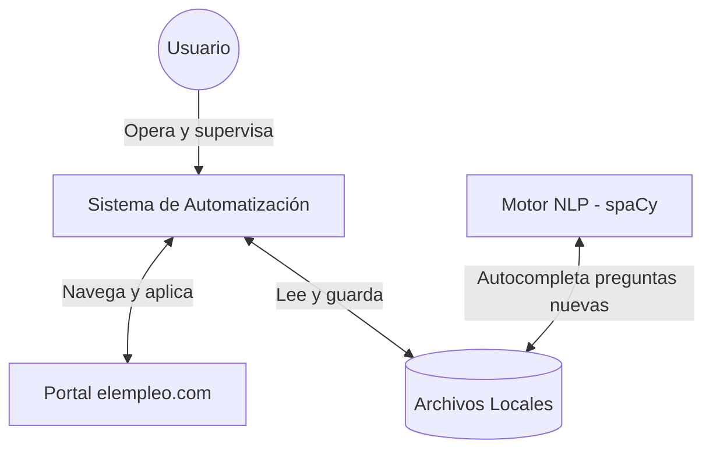
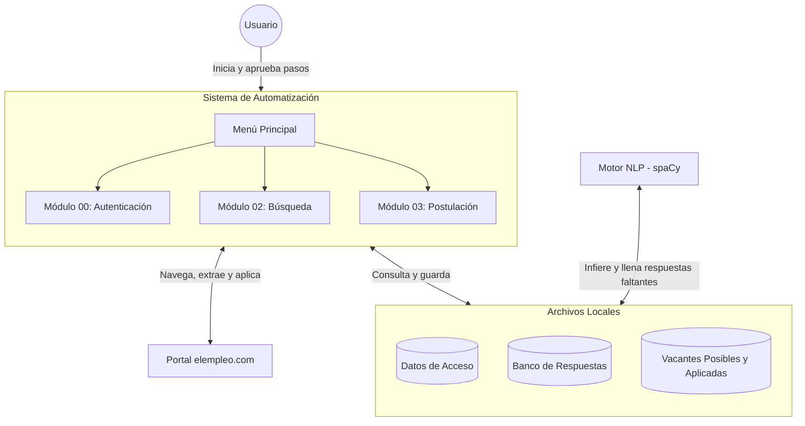

# Diagramas de Arquitectura

## 1. Contexto General
Visión macro de los componentes del proyecto y su relación.

## 2. Interacción Macro
Detalle interno de los componentes y flujos de comunicación externos.

